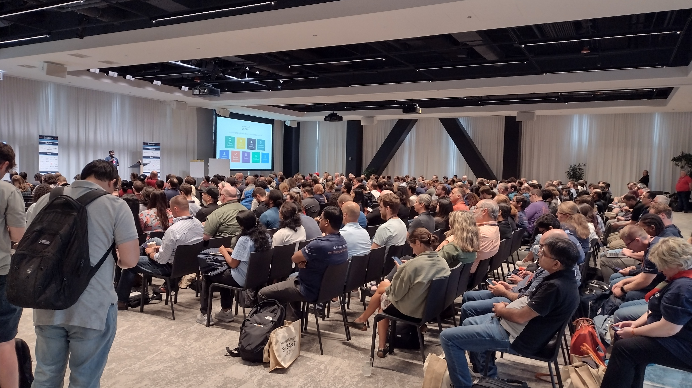
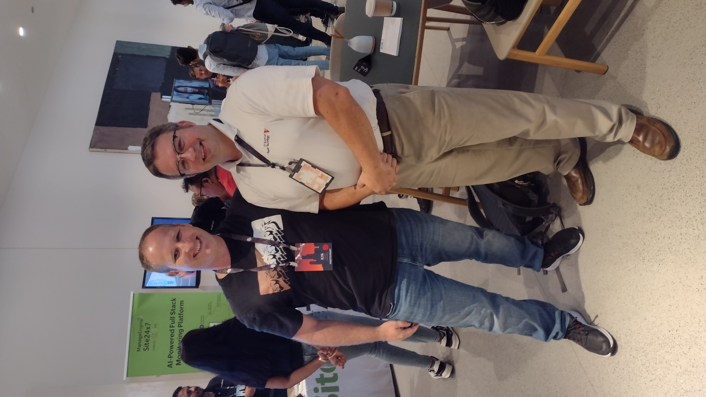

This is a short wrap up report of DevOps Days Chicago 2023. This is Chicago's largest non-vendor sponsored conference relating to IT Orchestration and Infrastructure.  DevOps itself can be vacuous to define as it also includes SRE, Platform Engineering, Observability, DevSecOps, and other nomencaltures to deploy software. The conference was single track and held in the Sears Tower in downtown Chicago.

## Major Conference Themes

The two major themes I heard spoken over the conference was:

* Industry needs to reduce their public cloud spend 
  * Amazon Web Services is hard and expensive to manage long term
  * Everyone is paying AWS a large amount of money and they want to reduce the spend
* Kubernetes is hard

## Tech Stacks Represented

In talking to attendees and conference vendors, two tech stacks were repeatedly mentioned as crucial to securely and sanely deploy software.

* [Terraform](https://www.terraform.io/ "Terraform for cross cloud infrastructure as code") from HashiCorp
  * Infrastruture as Code
* [Vault](https://www.hashicorp.com/products/vault "Secrets mangement") and [AWS Secrets Manager](https://docs.aws.amazon.com/secretsmanager/latest/userguide/intro.html "AWS Secrets Management")
  * Cloud Native Secrets Management

## IIT ITM Representation

It was good to see [Illinois Tech](https://iit.edu "Illinois Tech") and [ITM](https://www.iit.edu/itm) represented.  I ran into ITM grad number one, Ilya Mazya.

Ilya M. Mazya
Director of Engineering, DevOps @ RevenueWell

Along with a few other ITM grads.